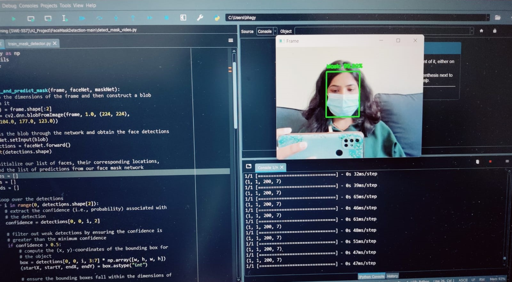
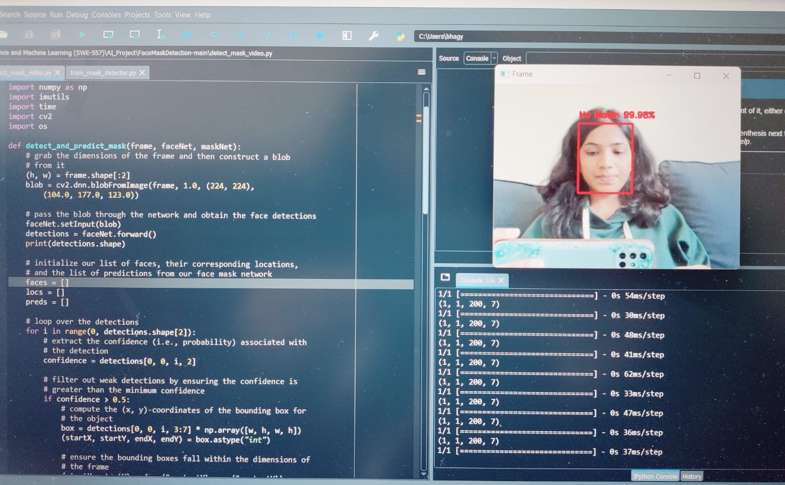
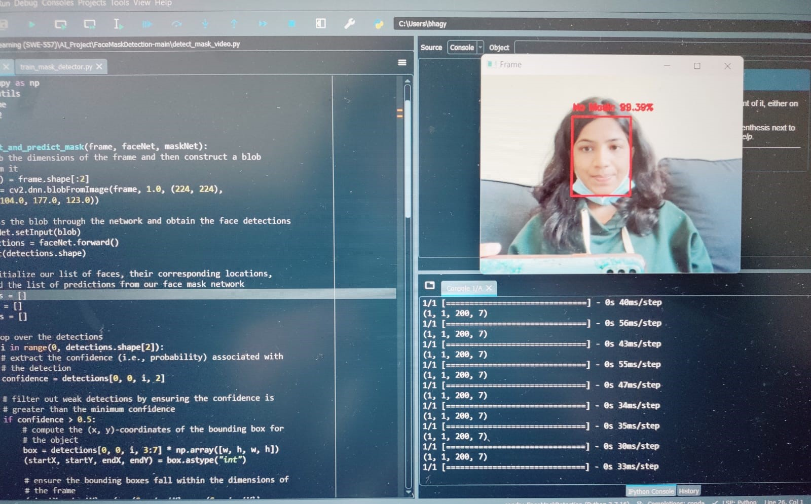

# Real Time Face Mask Detection

# About Project
 I used a Convolutional Neural Network, to differentiate between images of people with and without masks. CNN manages to get a accuracy of 99.3 on the training set. Then the sorted weights of this CNN are used to classify as mask or no mask, in real time OpenCV. With the webcam capturing the video, the frames are preprocessed and fed to the model to accomplish this task.  The model works efficiently with no apparent lag time between wearing/removing mask and display the prediction.

 The model can predict multiple faces with or without masks at the same time.

 # Use Cases:
  1. Use real time face mask detection system to check weather person wear mask 
   

  2.  Use real time face detection system to check person is not wearing the face mask
      
  
  3.   Use face mask detection system to check whether person wear mask correctly or not
       


 # Requirements
 - **Numpy** :

```
pip install numpy
```
- **Keras** :

```
pip install keras
```
- **Tensorflow** :

```
pip install tensorflow
```
- **OpenCV** :

```
pip install python-opencv
```

  

 
